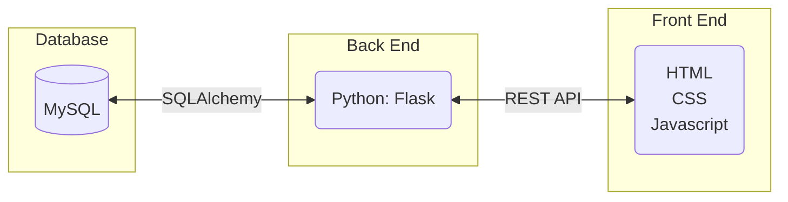
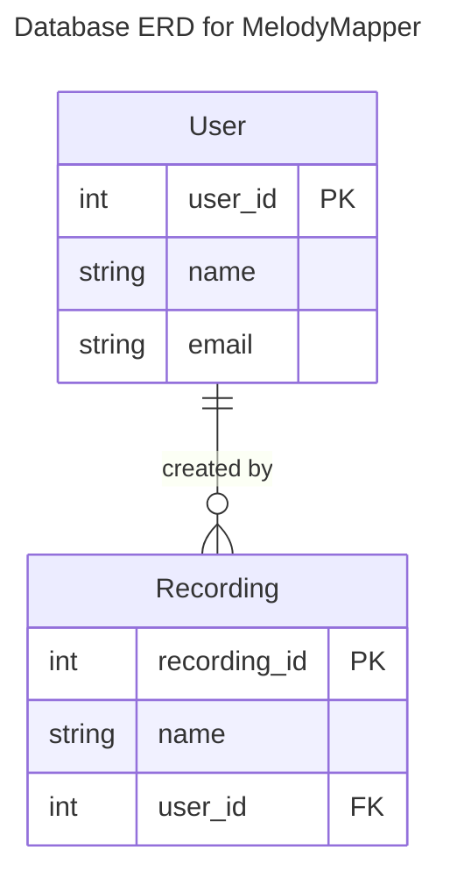
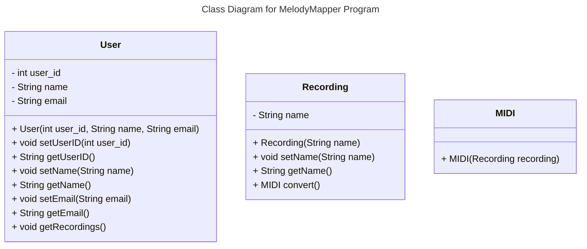
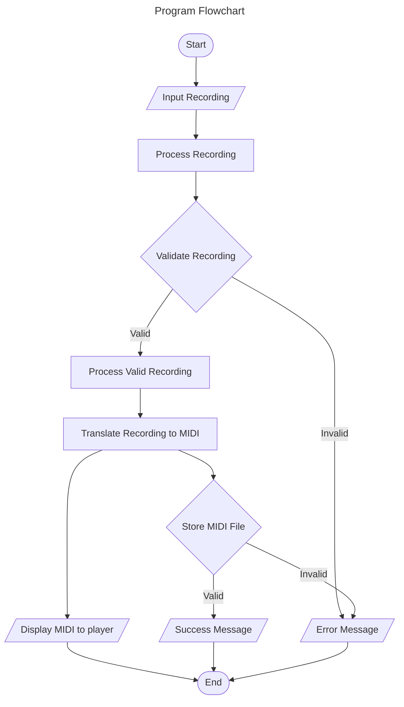
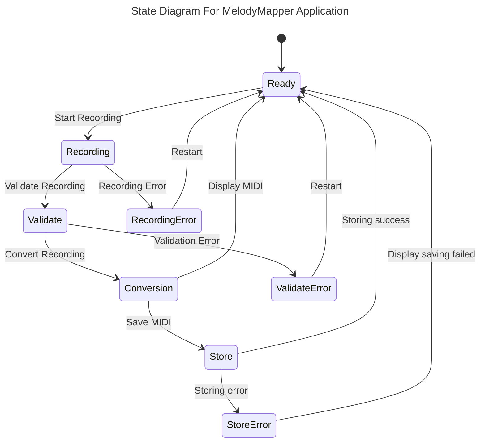
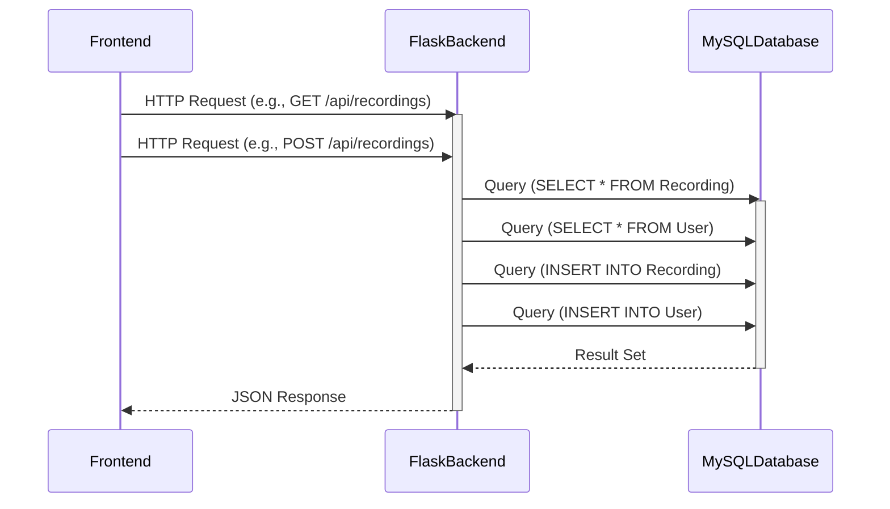

# Requirements and Specification Document

## Melody Mapper

### Project Abstract

Melody Mapper is an application designed to convert voiced melodies into MIDI format. Users can input melodies through voice, and the application will transform them into MIDI representation, allowing for storage and playback. This functionality enables users to easily capture and manipulate melodies for various purposes, such as music composition, analysis, or playback.

### Customer

The target customer for this software spans musicians, composers, music producers, and enthusiasts who engage in the creation and manipulation of melodies. Specifically, individuals who seek efficient methods to transcribe melodies from voice to MIDI format for further exploration, modification, or integration into their creative projects would find this application valuable. Moreover, educators and students in music-related fields could benefit from its functionality for educational purposes, facilitating learning and experimentation with musical concepts.

### User Requirements

| ID   | Description                                                  | Priority | Status |
| ---- | ------------------------------------------------------------ | -------- | ------ |
| R01  | Users should be able to record audio to be converted into MIDI format. | High      | Open   |
| R02  | Users should be able to name, date, and author audio recordings that are converted to MIDI format. | High     | Open   |
| R03  | Users should be able to playback previously converted audio recordings in MIDI format. | High     | Open   |
| R04  | Users should be able to see MIDI converted audio recordings as sheet music. | Medium      | Open   |
| R05  | Users should be able to download the converted audio recording MIDI file. | Medium     | Open   |

### Use Cases & User Stories

<!--Use cases and user stories that support the user requirements in the previous section. The use cases should be based off user stories. Every major scenario should be represented by a use case, and every use case should say something not already illustrated by the other use cases. Diagrams (such as sequence charts) are encouraged. Ask the customer what are the most important use cases to implement by the deadline. You can have a total ordering, or mark use cases with “must have,” “useful,” or “optional.” For each use case you may list one or more concrete acceptance tests (concrete scenarios that the customer will try to see if the use case is implemented).-->

Here is a sample user story from [Clean Agile](https://learning-oreilly-com.ezproxy.library.wisc.edu/library/view/clean-agile-back/9780135782002/ch03.xhtml#ch03lev1sec1) using a markdown block quote:

> As the driver of a car, in order to increase my velocity, I will press my foot harder on the accelerator pedal.

1. You
   1. Can
      1. Also
2. Use
   1. Numbered
      1. Lists

### User Interface Requirements

<!--Describes any customer user interface requirements including graphical user interface requirements as well as data exchange format requirements. This also should include necessary reporting and other forms of human readable input and output. This should focus on how the feature or product and user interact to create the desired workflow. Describing your intended interface as “easy” or “intuitive” will get you nowhere unless it is accompanied by details.-->

<!--NOTE: Please include illustrations or screenshots of what your user interface would look like -- even if they’re rough -- and interleave it with your description.-->

Images can be included with ``

### Security Requirements

<!--Discuss what security requirements are necessary and why. Are there privacy or confidentiality issues? Is your system vulnerable to denial-of-service attacks?-->

### System Requirements

<!--List here all of the external entities, other than users, on which your system will depend. For example, if your system inter-operates with sendmail, or if you will depend on Apache for the web server, or if you must target both Unix and Windows, list those requirements here. List also memory requirements, performance/speed requirements, data capacity requirements, if applicable.-->

| You    |    can    |    also |
| ------ | :-------: | ------: |
| change |    how    | columns |
| are    | justified |         |

### Specification

<!--A detailed specification of the system. UML, or other diagrams, such as finite automata, or other appropriate specification formalisms, are encouraged over natural language.-->

<!--Include sections, for example, illustrating the database architecture (with, for example, an ERD).-->

<!--Included below are some sample diagrams, including some example tech stack diagrams.-->

You can make headings at different levels by writing `# Heading` with the number of `#` corresponding to the heading level (e.g. `## h2`).

#### Technology Stack

1. HTML
2. CSS
3. Javascript
4. REST API
5. Flask (Python)
6. SQLAlchemy
7. MySQL
8. Docker



#### Database



#### Class Diagram



#### Flowchart



#### Behavior



#### Sequence Diagram



### Standards & Conventions

This portion of the document outlines the coding standards and conventions that are used in this project.

#### Coding Standards

The team prioritized the following coding standards during development:

1. **Simplicity:** Keep code simple which makes the code easier to understand, debug, and maintain.
2. **Modularity:** Encourages breaking down code into small, cohesive modules or functions that perform specific tasks.
3. **Scalability:** Write code that can scale to accommodate future growth in terms of efficiency and complexity.
4. **Consistency:** Enforce consistent naming conventions, formatting styles, and coding practices across the codebase.
5. **Documentation:** Include meaningful comments and documentation to explain complex logic, algorithms, or non-obvious behavior. Document public APIs, parameters, return values, and important implementation details.
6. **Version Control:** Utilize version control systems effectively to track changes, collaborate with team members, and manage codebase evolution. Follow branching and merging best practices to facilitate parallel development and code review processes.

#### Formatting Conventions

For Front End software development we use the VSCode extension [Prettier](https://marketplace.visualstudio.com/items?itemName=esbenp.prettier-vscode) in its default configuration. 
Back End development uses the VSCode extension [autopep8](https://marketplace.visualstudio.com/items?itemName=ms-python.autopep8) in its default configuration. 
These extensions provide out of the box solutions that are lightweight and easy to use.

You can also read more about the Python PEP 8 standard [here](https://peps.python.org/pep-0008/).

#### Naming Conventions

1. **Compound Names:** Compound names should use upper case letters to mark the beginning of the next word "likeThis" and "LikeThisToo"
2. **User-defined Types:** Names of user-defined types (files, classes, or enumerated types) should begin with upper case letters "LikeThis" or "This"
3. **Functions:** Names of functions, including class methods, should begin with lower case letters "likeThis()" or "this()"
4. **Variables:** Names of variables should begin with a lower case letter "likeThis" or "this"
5. **Boolean Variables:** Boolean variables should be named as questions or states to reflect their meaning. For example: "isReady", "hasPermission"
Constants: Names of constants should be written in uppercase letters with underscores separating words. For example: "MAX_SIZE", "PI_VALUE".
6. **Self-documenting Types and Functions:** Names of types and functions should be chosen to be self-documenting
7. **Meaningful Variables:** Names of meaningful variables should be chosen to be self-documenting. Names of variables whose function is internally important only, such as loop counters, should be simple.

#### Comment Conventions

1. **JavaScript:** For JavaScript functions, use JSDoc-style comments to provide documentation for functions. This includes a description of what the function does, parameters it accepts, and the return value.
```
/**
 * Calculate the sum of two numbers.
 * 
 * @param {number} num1 - The first number.
 * @param {number} num2 - The second number.
 * @returns {number} The sum of num1 and num2.
 */
function sum(num1, num2) {
    return num1 + num2;
}
```

2. **Python:** For Python functions, use docstrings to document the purpose, parameters, and return values of the function.
```
def calculate_sum(num1, num2):
    """
    Calculate the sum of two numbers.
    
    Args:
        num1 (int): The first number.
        num2 (int): The second number.
    
    Returns:
        int: The sum of num1 and num2.
    """
    return num1 + num2

```

3. **TODO Comments:** Use TODO comments to mark areas of code that need improvement or additional work. Include a brief description of what needs to be done and any relevant context.

#### File Headers Conventions

1. **JavaScript:**
```
/******************************************************************************
 * Filename: [File Name]
 * Purpose:  [Brief description of the purpose or functionality of the file]
 * Author:   [Author Name]
 * 
 * Description:
 * [Detailed description of the contents and functionality of the file.]
 * 
 * Usage (Optional):
 * [Instructions or examples demonstrating how to use the code in this file.
 * Include any dependencies or prerequisites required for proper usage.]

 * 
 * Notes:
 * [Any additional notes, considerations, or important information 
 * about the file that may be relevant to developers or users.]
 * 
 ******************************************************************************/
```

2. **Python:**
```
################################################################################
# Filename: [File Name]
# Purpose:  [Brief description of the purpose or functionality of the file]
# Author:   [Author Name]
#
# Description:
# [Detailed description of the contents and functionality of the file.]
#
# Usage (Optional):
# [Instructions or examples demonstrating how to use the code in this file.
# Include any dependencies or prerequisites required for proper usage.]
#
# Notes:
# [Any additional notes, considerations, or important information
# about the file that may be relevant to developers or users.]
#
###############################################################################
```