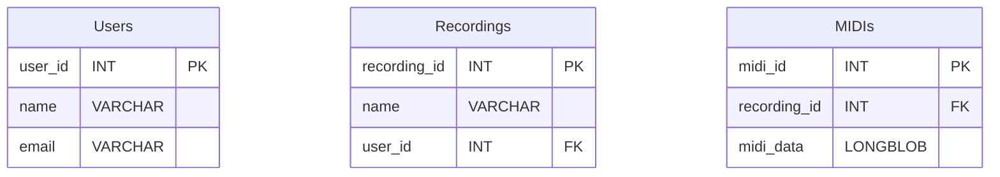
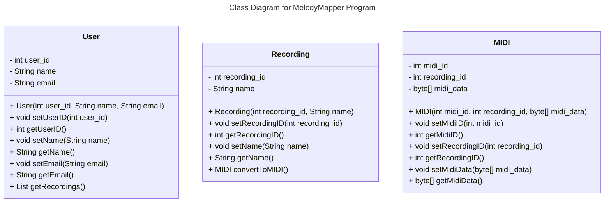

# Requirements and Specification Document

## Melody Mapper

### Project Abstract

Melody Mapper is an application designed to convert voiced melodies into MIDI format. Users can input melodies through voice, and the application will transform them into MIDI representation, allowing for storage and playback. This functionality enables users to easily capture and manipulate melodies for various purposes, such as music composition, analysis, or playback.

### Customer

The target customer for this software spans musicians, composers, music producers, and enthusiasts who engage in the creation and manipulation of melodies. Specifically, individuals who seek efficient methods to transcribe melodies from voice to MIDI format for further exploration, modification, or integration into their creative projects would find this application valuable. Moreover, educators and students in music-related fields could benefit from its functionality for educational purposes, facilitating learning and experimentation with musical concepts.

### Requirements

| ID | Description | Priority | Status |
| ---- | ------------------------------------------------------------ | -------- | ------ |
| R001 | The system shall send an MP3 file and metadata from the UI to the backend to be processed | High | Open |
| R002 | The system shall process the MP3 file sent to the backend into a MIDI file | High | Open |
| R003 | The system shall send the MIDI file and file metadata to the Database for Storage | High | Open |
| R004 | The system shall recieve a request from a user to retrieve a MIDI file from the database | High | Open |
| R005 | The system shall process a request for a MIDI file and query the database for results | High | Open |
| R006 | The system shall return a series of matching MIDI files found by the database query to the user | High | Open |

### Use Cases & User Stories

1. As the user of the websites, in order to record the recording, the user will be able to record, playback and download the audio they recorded.
    - Once the user is satified with the recording, the user will be prompted to name the recording, author the audio recording, and credit other users.
    - Once the user submits the recording for conversion, the resulting MIDI file will be returned and displayed as a music sheet.
2. As the user of the website, the user will be able to see a list of converted recordings.
    - The list contains all the converted recordings that all the users have created in the database.
3. As the user of the website, the user will be able to create an account.
4. As the user of the website, the user can see a history of the converted recordings they have done.
5. As the user of the website, the user will be able to download the converted audio recording in a MIDI file format.


### User Interface Requirements

Website without user account
1. A button with microphone icon for receiving live recording and convert into the format of .wav, .m4a, and .mp3
2. A button with file upload icon for allowing the uploads of recording files in the format of .wav, .m4a, and .mp3
3. History section to show the details of previous conversion with credited author and date


Website with user account
1. A button with microphone icon for receiving live recording and convert into the format of .wav, .m4a, and .mp3
2. A button with file upload icon for allowing the uploads of recording files in the format of .wav, .m4a, and .mp3
3. A button with user icon on the top right for user account
Three lines to show the content of the user account page
    a. Settings
    b. Conversion history from this user
4. History section to show the details of previous conversion with credited author and date


### Security Requirements

- Our system will only record audio in between when the user has clicked the start and stop recording button.
- Our system will only store the MIDI file converted from audio recordings.
    - The system will state that the audio recordings will only be used for converting into the MIDI file.
    - MIDI files will be stored in the database and open for all users to see.
    - The system will not save audio recordings because users may want to avoid having their voice being recorded and stored on the system.
- Our system will be vulnerable to denial-of-service attacks.

### System Requirements

| Library |    Description    | Performance |
| ------ | ------- | ------ |
| Flask | A framework to work as a backend server | TBD |
| Mido |    A library to work with MIDI format files    | TBD |
| SQLAlchemy    |  A library for Python to work with SQL database | TBD |

### Specification

#### Technology Stack

1. HTML
2. CSS
3. Javascript
4. REST API
5. Flask (Python)
6. SQLAlchemy
7. MySQL
8. Docker


#### Database Schema



#### Class Diagram



#### Flowchart


#### Behavior


#### Sequence Diagram


### Standards & Conventions

This portion of the document outlines the coding standards and conventions that are used in this project.

#### Coding Standards

The team prioritized the following coding standards during development:

1. **Simplicity:** Keep code simple which makes the code easier to understand, debug, and maintain.
2. **Modularity:** Encourages breaking down code into small, cohesive modules or functions that perform specific tasks.
3. **Scalability:** Write code that can scale to accommodate future growth in terms of efficiency and complexity.
4. **Consistency:** Enforce consistent naming conventions, formatting styles, and coding practices across the codebase.
5. **Documentation:** Include meaningful comments and documentation to explain complex logic, algorithms, or non-obvious behavior. Document public APIs, parameters, return values, and important implementation details.
6. **Version Control:** Utilize version control systems effectively to track changes, collaborate with team members, and manage codebase evolution. Follow branching and merging best practices to facilitate parallel development and code review processes.

#### Formatting Conventions

For Front End software development we use the VSCode extension [Prettier](https://marketplace.visualstudio.com/items?itemName=esbenp.prettier-vscode) in its default configuration. 
Back End development uses the VSCode extension [autopep8](https://marketplace.visualstudio.com/items?itemName=ms-python.autopep8) in its default configuration. 
These extensions provide out of the box solutions that are lightweight and easy to use.

You can also read more about the Python PEP 8 standard [here](https://peps.python.org/pep-0008/).

#### Naming Conventions

1. **Compound Names:** Compound names should use upper case letters to mark the beginning of the next word "likeThis" and "LikeThisToo"
2. **User-defined Types:** Names of user-defined types (files, classes, or enumerated types) should begin with upper case letters "LikeThis" or "This"
3. **Functions:** Names of functions, including class methods, should begin with lower case letters "likeThis()" or "this()"
4. **Variables:** Names of variables should begin with a lower case letter "likeThis" or "this"
5. **Boolean Variables:** Boolean variables should be named as questions or states to reflect their meaning. For example: "isReady", "hasPermission"
Constants: Names of constants should be written in uppercase letters with underscores separating words. For example: "MAX_SIZE", "PI_VALUE".
6. **Self-documenting Types and Functions:** Names of types and functions should be chosen to be self-documenting
7. **Meaningful Variables:** Names of meaningful variables should be chosen to be self-documenting. Names of variables whose function is internally important only, such as loop counters, should be simple.

#### Comment Conventions

1. **JavaScript:** For JavaScript functions, use JSDoc-style comments to provide documentation for functions. This includes a description of what the function does, parameters it accepts, and the return value.
```
/**
 * Calculate the sum of two numbers.
 * 
 * @param {number} num1 - The first number.
 * @param {number} num2 - The second number.
 * @returns {number} The sum of num1 and num2.
 */
function sum(num1, num2) {
    return num1 + num2;
}
```

2. **Python:** For Python functions, use docstrings to document the purpose, parameters, and return values of the function.
```
def calculate_sum(num1, num2):
    """
    Calculate the sum of two numbers.
    
    Args:
        num1 (int): The first number.
        num2 (int): The second number.
    
    Returns:
        int: The sum of num1 and num2.
    """
    return num1 + num2

```

3. **TODO Comments:** Use TODO comments to mark areas of code that need improvement or additional work. Include a brief description of what needs to be done and any relevant context.

#### File Headers Conventions

1. **JavaScript:**
```
/******************************************************************************
 * Filename: [File Name]
 * Purpose:  [Brief description of the purpose or functionality of the file]
 * Author:   [Author Name]
 * 
 * Description:
 * [Detailed description of the contents and functionality of the file.]
 * 
 * Usage (Optional):
 * [Instructions or examples demonstrating how to use the code in this file.
 * Include any dependencies or prerequisites required for proper usage.]
 * 
 * Notes:
 * [Any additional notes, considerations, or important information 
 * about the file that may be relevant to developers or users.]
 * 
 ******************************************************************************/
```

2. **Python:**
```
################################################################################
# Filename: [File Name]
# Purpose:  [Brief description of the purpose or functionality of the file]
# Author:   [Author Name]
#
# Description:
# [Detailed description of the contents and functionality of the file.]
#
# Usage (Optional):
# [Instructions or examples demonstrating how to use the code in this file.
# Include any dependencies or prerequisites required for proper usage.]
#
# Notes:
# [Any additional notes, considerations, or important information
# about the file that may be relevant to developers or users.]
#
###############################################################################
```
